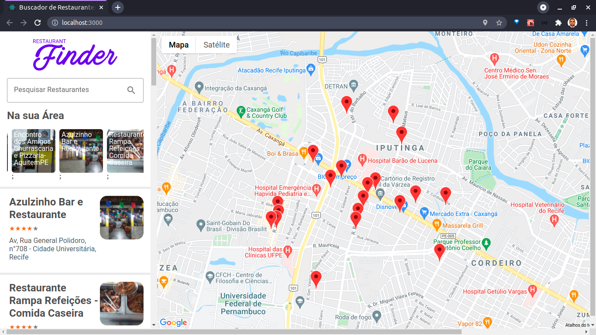

<h1 align="center">
    
</h1>

  <a href="#-projeto">Projeto</a>&nbsp;&nbsp;&nbsp;|&nbsp;&nbsp;&nbsp;
  <a href="#-layout">Layout</a>&nbsp;&nbsp;&nbsp;|&nbsp;&nbsp;&nbsp;
  <a href="#-tecnologias">Tecnologias</a>&nbsp;&nbsp;&nbsp;|&nbsp;&nbsp;&nbsp;
  <a href="#-executando">Executando</a>&nbsp;&nbsp;&nbsp;|&nbsp;&nbsp;&nbsp;
  <a href="#memo-licença">Licença</a>

 

## 💻 Projeto

Sistema web de busca de restaurantes, parecido com o serviço que o Google oferece. Desenvolvido com React.JS e API do Google.

## 🎨 Layout

    
    

  
 

## :rocket: Tecnologia

Esse projeto foi desenvolvido com as seguintes tecnologia:

- [ReactJS](https://pt-br.reactjs.org/)

\* Para mais detalhes, veja o <kbd>[package.json](./package.json)</kbd>

## :notebook: Executando

### Pré-requisitos

# Clone este repositório
$ git clone https://github.com/antoniodecastroalves/-restaurants-search-dio.git

# Acesse a pasta do projeto no seu terminal/cmd
$ cd restaurants-search-dio

# Instale as dependências
$ yarn install

# Execute a aplicação
$ yarn start

## :memo: Licença

Esse projeto está sob a licença MIT. Veja o arquivo [LICENSE](LICENSE.md) para mais detalhes.

---

Feito com amor por [Antonio Alves](https://www.linkedin.com/in/antonio-alves-490b5646/) 
